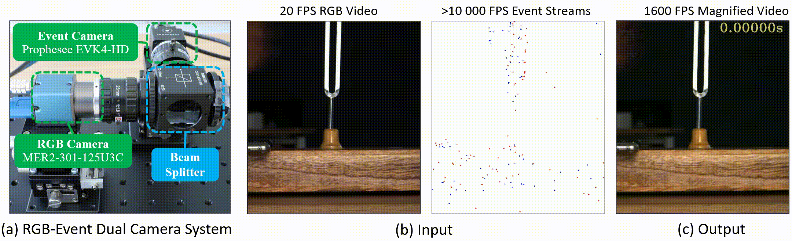

# Event-Based Motion Magnification
### [Project Page](https://openimaginglab.github.io/emm/) | [Video](https://youtu.be/WmI7bv9nqjI) | [Paper](https://arxiv.org/pdf/2402.11957.pdf) | [Data]() <br>

Yutian Chen, Shi Guo, Fangzheng Yu, Feng Zhang, Jinwei Gu, Tianfan Xue <br><br>


<p align="left" width="100%">
    
</p>

- [ ] Release the real-captured dataset
- [ ] Release the synthetic testset.
- [x] Release the training and testing code.
- [x] Release the pretrained model.

## Installation
This implementation based on [BasicSR](https://github.com/xinntao/BasicSR) which is a open source toolbox for image/video restoration tasks. 


```
git clone https://github.com/OpenImagingLab/emm.git
cd emm
pip install -r requirements.txt
python setup.py develop --no_cuda_ext
```

## Running code
### Train
Refer to the [REAME.md](https://github.com/OpenImagingLab/emm/blob/main/data_preparation/README.md) for instructions on preparing training data. We also provide a tiny [training set](https://github.com/OpenImagingLab/emm/tree/main/datasets/trainset_tiny) as an example.

To train the EMM model:
```
bash train.sh
```

### Test
To test the EMM model with real-captured video:
```
bash test.sh
```  


## Citations
```
@misc{chen2024eventbased,
      title={Event-Based Motion Magnification}, 
      author={Yutian Chen and Shi Guo and Fangzheng Yu and Feng Zhang and Jinwei Gu and Tianfan Xue},
      year={2024},
      eprint={2402.11957},
      archivePrefix={arXiv},
      primaryClass={cs.CV}
}
```


